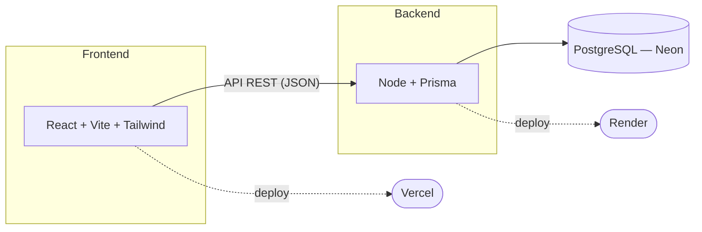

<div align="center">
  <h1>🤰 Lar Renascer — Plataforma Web</h1>
  <p><em>Tecnologia a serviço de quem acolhe quem mais precisa</em></p>
</div>

---

## 📑 Sumário
- [Sobre o projeto](#-sobre-o-projeto)
- [O problema e a solução](#-o-problema-e-a-solução)
- [Funcionalidades do MVP](#-funcionalidades-do-mvp)
- [Links do projeto em produção](#-links-do-projeto-em-produção)
- [Tecnologias utilizadas](#-tecnologias-utilizadas)
- [Arquitetura](#-arquitetura)
- [Como executar o projeto](#-como-executar-o-projeto)
- [Estrutura de pastas](#-estrutura-de-pastas)
- [Referência rápida da API](#-referência-rápida-da-api)
- [Segurança e privacidade](#-segurança-e-privacidade)
- [Equipe](#-equipe)
- [Agradecimentos](#-agradecimentos)

---

## 🌱 Sobre o projeto

Este repositório reúne o MVP (Produto Minimamente Viável) desenvolvido como projeto de **[Desenvolvimento de Software]**, do curso de **[Análise e Desenvolvimento de Sistemas]** da universidade **[UniSENAI Campus Joinville]**, sob orientação de **[Tiago Ricaldi e Emerson Amancio]**.

O grupo escolheu como causa social o **Lar Renascer**, uma casa de acolhimento que recebe gestantes em situação de  vulnerabilidade social, oferecendo a elas e aos seus filhos um ambiente seguro durante a gestação.

O projeto nasce de um problema concreto, identificado em conversa direta com a instituição: o site atual do Lar Renascer tem baixa visibilidade e não oferece nenhuma ferramenta de gestão para o dia a dia da casa — tudo ainda é feito de forma manual e descentralizada.

---

## 🎯 O problema e a solução

| Problema identificado | Como o MVP resolve |
| :--- | :--- |
| Site institucional com baixa visibilidade e desorganizado, sem funcionalidades relevantes | Site com design estruturado para chamar atenção da causa e com novas funcionalidades |
| Cadastro de gestantes acolhidas feito manualmente, sem histórico organizado | Formulário de cadastro que alimenta um banco de dados estruturado |
| Doações sem nenhum controle ou forma de identificar quem ajudou | Página de doação com QR Code Pix dinâmico + registro dos dados de quem doa, com exportação em CSV |
| Equipe da casa sem tempo/conhecimento técnico para administrar um sistema complexo | Área interna com painéis independentes, protegida por senha única — sem exigir cadastro de usuário |

---

## ✅ Funcionalidades do MVP

- [x] Landing page institucional (testemunhos, empresas parceiras, direitos das gestantes e de adoção)
- [x] Cadastro de gestantes que precisam de acolhimento
- [x] Página de doação com QR Code Pix dinâmico + registro de doadores
- [x] Exportação da lista de doadores em CSV
- [x] Telas frontend concluídas (landing page, cadastro e doação)
- [x] Painéis internos de relatórios (Gestantes e Doações) protegidos por login simplificado

---
## 🔗 Links do Projeto em Produção

O projeto encontra-se totalmente implantado em ambiente de nuvem e pode ser acessado através dos links oficiais abaixo:

* **💻 Plataforma Web (Frontend):** [https://tcc-lar-renascer.vercel.app](https://tcc-lar-renascer.vercel.app)
* **🔒 Painel Restrito de Gestantes:** [https://tcc-lar-renascer.vercel.app/painel-gestantes](https://tcc-lar-renascer.vercel.app/painel-gestantes)
* **⚙️ Servidor Backend (API REST):** [https://tcc-lar-renascer.onrender.com](https://tcc-lar-renascer.onrender.com)
---

## 🛠 Tecnologias utilizadas

| Camada | Tecnologia |
| :--- | :--- |
| **Frontend** | React, Vite, Tailwind CSS, Navegação SPA por Estado |
| **Backend** | Node.js |
| **ORM / Banco de dados** | Prisma + PostgreSQL (Neon) |
| **Autenticação da área interna** | HTTP Basic Auth com injeção de credenciais base64 no Frontend |
| **Pagamentos** | Geração de Pix dinâmico no padrão BR Code (EMV) |
| **Deploy** | Vercel (frontend) + Render (backend) |

---

## 🏗 Arquitetura


---

## 🚀 Como executar o projeto

### Pré-requisitos
* Node.js 18 ou superior
* Uma conta gratuita no Neon (ou outro Postgres acessível)

### Backend

```bash
cd backend
npm install
cp .env.example .env
# Edite o .env com a DATABASE_URL do Neon, a senha da área interna e os dados do Pix

npx prisma migrate dev --name init   # cria as tabelas no banco
npm run dev                          # inicia em http://localhost:3333
```

### Frontend

```bash
cd frontend
npm install
npm run dev                          # inicia em http://localhost:5173
```
> **Nota de deploy:** Para rodar o frontend na Vercel corretamente com links ocultos, certifique-se de que o arquivo `vercel.json` de reescrita de rotas esteja na raiz do frontend.

---

## 📂 Estrutura de pastas

```text
.
├── backend/
│   ├── prisma/
│   │   └── schema.prisma        # modelagem do banco (gestantes, doações, testemunhos...)
│   ├── src/
│   │   ├── middleware/
│   │   │   └── basicAuth.js     # proteção da área interna
│   │   ├── routes/
│   │   ├── utils/
│   │   │   └── pix.js           # geração do payload do Pix dinâmico
│   │   ├── prismaClient.js
│   │   └── server.js
│   ├── .env.example
│   └── package.json
├── frontend/
│   ├── src/
│   │   ├── components/
│   │   │   ├── Doacoes.jsx
│   │   │   ├── Gestantes.jsx
│   │   │   ├── LandingPage.jsx
│   │   │   ├── RelatorioDoacoes.jsx   # Painel interno seguro
│   │   │   └── RelatorioGestantes.jsx # Painel interno seguro
│   │   ├── App.jsx              # Roteamento SPA Customizado
│   │   └── main.jsx
│   ├── vercel.json              # Regras de redirect para corrigir o erro 404
│   └── package.json
└──
```

---

## 📡 Referência rápida da API

| Método | Rota | Acesso | Descrição |
| :--- | :--- | :--- | :--- |
| `POST` | `/gestantes` | Pública | Envia um novo cadastro de gestante |
| `GET` | `/gestantes/interno`| 🔒 Interna | Lista todos os cadastros |
| `PATCH`| `/gestantes/:id` | 🔒 Interna | Atualiza o status do cadastro |
| `GET` | `/doacoes/pix` | Pública | Retorna o payload do Pix dinâmico |
| `POST` | `/doacoes` | Pública | Registra os dados de uma doação |
| `GET` | `/doacoes` | 🔒 Interna | Lista as doações registradas |
| `GET` | `/doacoes/export/csv` | 🔒 Interna | Exporta as doações em CSV |
| `GET` | `/testemunhos` | Pública | Lista os testemunhos aprovados |
| `POST` | `/testemunhos` | 🔒 Interna | Cadastra um novo testemunho |

> 🔒 *Rotas internas exigem usuário e senha via HTTP Basic Auth.*

---

## 🔐 Segurança e privacidade

Este projeto lida com dados de pessoas em situação real de vulnerabilidade, o que exige cuidados acima da média de um projeto acadêmico comum:

* Os dados de cadastro de gestantes **nunca são expostos em rota pública** — apenas na área interna, protegida por painel de login.
* Testemunhos publicados usam apenas o primeiro nome ou "Anônimo" por padrão.
* Senhas e chaves sensíveis ficam apenas em variáveis de ambiente (`.env`), nunca no código-fonte.

--

## 👥 Equipe

| Nome | 
| :--- | 
| [Flávia Martins] |
| [Yori Gandalf] |
| [João Clemente] | 

---


## 🙏 Agradecimentos

Agradecemos à equipe do Lar Renascer pela confiança e disponibilidade em compartilhar sua rotina e suas necessidades reais e aos professores pela oportunidade de aprendizado e que guiaram cada decisão técnica deste projeto!
