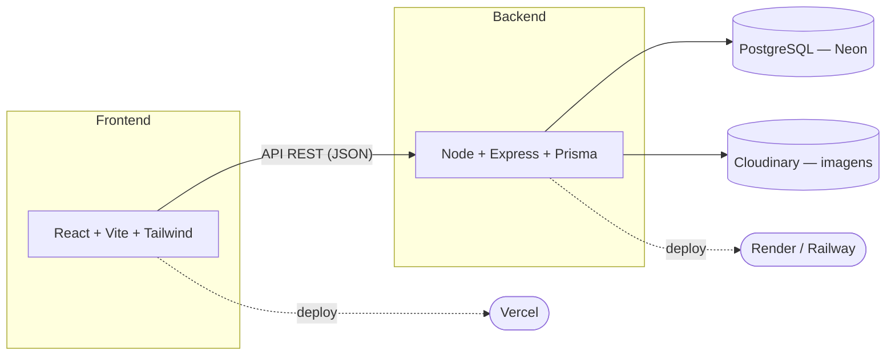
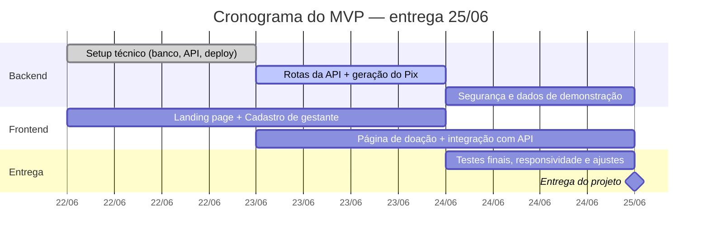

<div align="center">
  <h1>🤰 Lar Renascer — Plataforma Web</h1>
  <p><em>Tecnologia a serviço de quem acolhe quem mais precisa</em></p>
</div>

---

## 📑 Sumário
- [Sobre o projeto](#-sobre-o-projeto)
- [O problema e a solução](#-o-problema-e-a-solução)
- [Funcionalidades do MVP](#-funcionalidades-do-mvp)
- [Tecnologias utilizadas](#-tecnologias-utilizadas)
- [Arquitetura](#-arquitetura)
- [Cronograma](#-cronograma)
- [Como executar o projeto](#-como-executar-o-projeto)
- [Estrutura de pastas](#-estrutura-de-pastas)
- [Referência rápida da API](#-referência-rápida-da-api)
- [Segurança e privacidade](#-segurança-e-privacidade)
- [Fluxo de trabalho do grupo](#-fluxo-de-trabalho-do-grupo)
- [Trabalhos futuros](#-trabalhos-futuros)
- [Equipe](#-equipe)
- [Licença](#-licença)
- [Agradecimentos](#-agradecimentos)

---

## 🌱 Sobre o projeto

Este repositório reúne o MVP (Produto Minimamente Viável) desenvolvido como projeto de **[nome da disciplina]**, do curso de **[nome do curso]** da **[nome da instituição]**, sob orientação de **[nome do professor(a) orientador(a)]**.

O grupo escolheu como causa social o **Lar Renascer**, uma casa de acolhimento que recebe gestantes em situação de abuso, violência doméstica, dependência química/alcoólica ou vulnerabilidade social, oferecendo a elas e aos seus filhos um ambiente seguro durante a gestação.

O projeto nasce de um problema concreto, identificado em conversa direta com a instituição: o site atual do Lar Renascer tem baixa visibilidade e não oferece nenhuma ferramenta de gestão para o dia a dia da casa — tudo ainda é feito de forma manual e descentralizada.

> 📄 Toda a documentação de planejamento (escopo, divisão de tarefas, cronograma detalhado e cuidados de segurança) está no arquivo `manual_mvp_lar_renascer.pdf`, elaborado junto com o grupo antes do início da implementação.

---

## 🎯 O problema e a solução

| Problema identificado | Como o MVP resolve |
| :--- | :--- |
| Site institucional pouco visível, sem destaque para quem ajuda a instituição | Landing page com testemunhos reais, vitrine de empresas parceiras e seção de direitos das gestantes e de adoção |
| Cadastro de gestantes acolhidas feito manualmente, sem histórico organizado | Formulário de cadastro que alimenta um banco de dados estruturado |
| Doações sem nenhum controle ou forma de identificar quem ajudou | Página de doação com QR Code Pix + registro dos dados de quem doa, com exportação em CSV |
| Equipe da casa sem tempo/conhecimento técnico para administrar um sistema complexo | Área interna simples, protegida por senha única — sem exigir cadastro de usuário |

---

## ✅ Funcionalidades do MVP

- [x] Landing page institucional (testemunhos, empresas parceiras, direitos das gestantes e de adoção)
- [x] Cadastro de gestantes que precisam de acolhimento
- [x] Página de doação com QR Code Pix estático + registro de doadores
- [x] Exportação da lista de doadores em CSV
- [x] Área interna protegida por senha compartilhada
- [ ] Frontend (landing page, cadastro e doação) — em desenvolvimento pela equipe
- [ ] Contas individuais de acesso para a equipe do Lar Renascer (trabalho futuro)

---

## 🛠 Tecnologias utilizadas

| Camada | Tecnologia |
| :--- | :--- |
| **Frontend** | React, Vite, Tailwind CSS, React Router |
| **Backend** | Node.js, Express, Zod |
| **ORM / Banco de dados** | Prisma + PostgreSQL (Neon) |
| **Autenticação da área interna** | HTTP Basic Auth (senha compartilhada via variável de ambiente) |
| **Pagamentos** | Pix estático no padrão BR Code (EMV), gerado a partir da chave Pix real da instituição |
| **Armazenamento de imagens** | Cloudinary |
| **Deploy** | Vercel (frontend) + Render/Railway (backend) |

---

## 🏗 Arquitetura



---

## 🗓 Cronograma



---

## 🚀 Como executar o projeto

### Pré-requisitos
* Node.js 18 ou superior
* Uma conta gratuita no Neon (ou outro Postgres acessível)
* A chave Pix real da instituição (para gerar o QR Code de doação)

### Backend

```bash
cd backend
npm install
cp .env.example .env
# edite o .env com a DATABASE_URL do Neon, a senha da área interna e a chave Pix

npx prisma migrate dev --name init   # cria as tabelas no banco
npm run dev                          # inicia em http://localhost:3333
```

### Frontend

Em desenvolvimento pela equipe — instruções serão adicionadas aqui quando o pacote inicial (`create-vite`) for finalizado.

```bash
cd frontend
npm install
npm run dev
```

---

## 📂 Estrutura de pastas

```text
.
├── backend/
│   ├── prisma/
│   │   └── schema.prisma        # modelagem do banco (gestantes, doações, testemunhos...)
│   ├── src/
│   │   ├── middleware/
│   │   │   └── basicAuth.js     # proteção da área interna
│   │   ├── routes/
│   │   │   ├── gestantes.routes.js
│   │   │   ├── doacoes.routes.js
│   │   │   ├── testemunhos.routes.js
│   │   │   └── empresas.routes.js
│   │   ├── utils/
│   │   │   └── pix.js           # geração do payload Pix (BR Code)
│   │   ├── prismaClient.js
│   │   ├── app.js
│   │   └── server.js
│   ├── .env.example
│   └── package.json
├── frontend/                    # em desenvolvimento
└── manual_mvp_lar_renascer.pdf  # planejamento completo do projeto
```

---

## 📡 Referência rápida da API

| Método | Rota | Acesso | Descrição |
| :--- | :--- | :--- | :--- |
| `POST` | `/gestantes` | Pública | Envia um novo cadastro de gestante |
| `GET` | `/gestantes` | 🔒 Interna | Lista todos os cadastros |
| `PATCH` | `/gestantes/:id` | 🔒 Interna | Atualiza o status do cadastro |
| `GET` | `/doacoes/pix` | Pública | Retorna o payload do Pix (para gerar o QR Code) |
| `POST` | `/doacoes` | Pública | Registra os dados de uma doação |
| `GET` | `/doacoes` | 🔒 Interna | Lista as doações registradas |
| `GET` | `/doacoes/export/csv` | 🔒 Interna | Exporta as doações em CSV |
| `GET` | `/testemunhos` | Pública | Lista os testemunhos aprovados |
| `POST` | `/testemunhos` | 🔒 Interna | Cadastra um novo testemunho |

> 🔒 *Rotas internas exigem usuário e senha via HTTP Basic Auth (variáveis `INTERNAL_AUTH_USER` e `INTERNAL_AUTH_PASS`).*

---

## 🔐 Segurança e privacidade

Este projeto lida com dados de pessoas em situação real de vulnerabilidade, o que exige cuidados acima da média de um projeto acadêmico comum:

* Os dados de cadastro de gestantes **nunca são expostos em rota pública** — apenas na área interna, protegida por senha.
* Testemunhos publicados usam apenas o primeiro nome ou "Anônimo" por padrão.
* O endereço físico da instituição não é divulgado em nenhuma página pública.
* Senhas e chaves sensíveis ficam apenas em variáveis de ambiente (`.env`), nunca no código-fonte.

---

## 🔄 Fluxo de trabalho do grupo

* A branch `main` contém apenas código validado e funcionando.
* Cada integrante trabalha na própria branch (ex: `feat/backend`, `feat/landing-page`) e abre um Pull Request para integrar o trabalho.
* Sincronizações diárias acontecem no horário de aula (19h–22h), quando o grupo trabalha presencialmente no projeto.

---

## 🔮 Trabalhos futuros

* Contas individuais de acesso para a equipe do Lar Renascer (substituindo a senha compartilhada).
* Integração com gateway de pagamento para confirmação automática das doações via Pix.
* Fluxo de aprovação/moderação de testemunhos.
* Aplicativo mobile.

---

## 👥 Equipe

| Nome | Função no projeto | GitHub |
| :--- | :--- | :--- |
| Seu nome | Backend, banco de dados, deploy, integração Pix | [@usuario](https://github.com/usuario) |
| Nome do colega A | Frontend — Landing page | [@usuario](https://github.com/usuario) |
| Nome do colega B | Frontend — Cadastro e Doação | [@usuario](https://github.com/usuario) |

---

## 📄 Licença

Distribuído sob a licença MIT — ajustem livremente conforme a orientação da disciplina ou preferência da instituição parceira.

---

## 🙏 Agradecimentos

Agradecemos à equipe do Lar Renascer pela confiança e disponibilidade em compartilhar sua rotina e suas necessidades reais, que guiaram cada decisão técnica deste projeto.